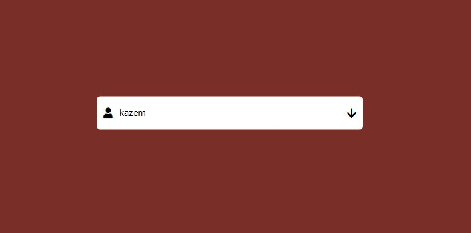

#Simple Form Animation
This is a login form in which animation has been utilized.

The user must enter his username. If the username is correct the webpage background will remain blue, but if it is wrong the background will be turn into red, in this case all usernames are considered correct providing they have more than 7 characters.

Here you see that the username is less than 7 characters and the background turned into red and also the input box will tilt upward a bit as a shake effect.

